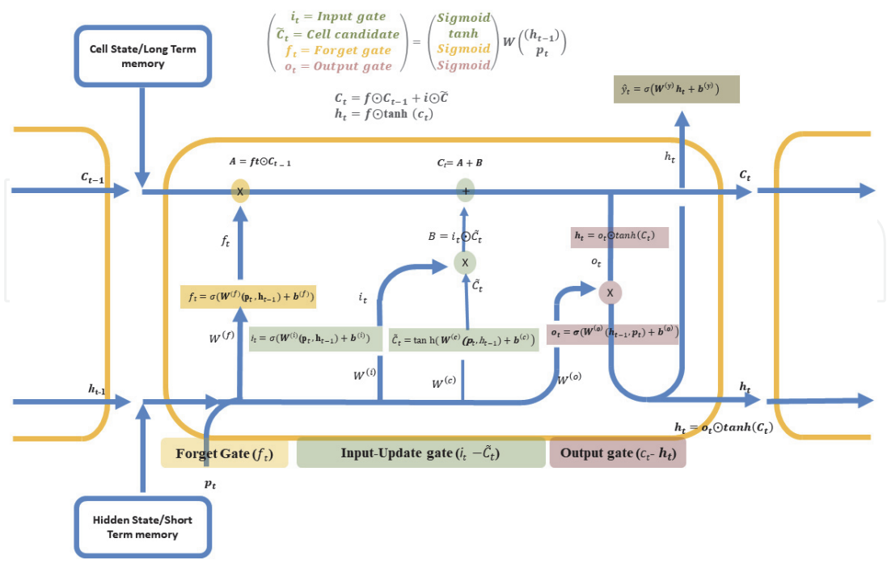

### Theory

#### Introduction to Sentiment Analysis
Sentiment Analysis is a supervised Natural Language Processing (NLP) task that aims to automatically identify and classify the emotional polarity expressed in textual data. The most common form of sentiment analysis focuses on determining whether a given text conveys a positive or negative sentiment. This task plays a crucial role in applications such as opinion mining, customer feedback analysis, recommendation systems, market analysis, and social media monitoring.

In this experiment, sentiment analysis is formulated as a binary classification problem, where the objective is to predict the sentiment label of a movie review based on its textual content:

$$y \in \{0, 1\}$$

where,
- $y = 0$ represents a Negative review,
- $y = 1$ represents a Positive review.

Since textual data is inherently sequential, capturing word order and contextual dependencies is
essential for accurate sentiment prediction. Recurrent Neural Networks (RNNs) and their advanced
variants, such as Long Short-Term Memory (LSTM) networks, are particularly well-suited for this task.

---

#### Long Short-Term Memory (LSTM)

Long Short-Term Memory (LSTM) is a specialized type of Recurrent Neural Network (RNN) designed to mitigate the vanishing gradient problem in traditional RNNs and improve the learning of long-term dependencies in sequential data. LSTM networks were introduced by Hochreiter and Schmidhuber in 1997 with the explicit goal of enabling neural networks to learn and retain long-term dependencies in sequential data.

Unlike standard RNNs, which rely solely on a single hidden state, LSTMs introduce an internal cell state that acts as a memory pipeline. This cell state allows information to flow across time steps with minimal modification, making it easier for gradients to propagate during backpropagation through time (BPTT). As a result, LSTMs are capable of remembering important contextual information over long sequences while selectively forgetting irrelevant details.

**LSTM Cell Components-**

An LSTM cell consists of several interacting components that regulate the flow of information using gating mechanisms. These gates are implemented using sigmoid and tanh activation functions, which enable fine-grained control over memory updates.

1.  **Forget Gate ($f_t$):** The forget gate determines which information from the previous cell state should be retained or discarded. This process is implemented by a sigmoid activation function. The decision is based on the previous hidden state and the current input. The output of the forget gate is a vector of values between 0 and 1, where values close to 0 indicate information to be forgotten, and values close to 1 indicate information to be retained.

    $$f_t = \sigma(W_f[h_{t-1}, p_t] + b_f)$$

2.  **Input Gate ($i_t$):** The input gate controls the extent to which new information from the current input should be written to the cell state. This gate protects the memory from being corrupted by irrelevant or noisy inputs and ensures that only meaningful information is incorporated.

    $$i_t = \sigma(W_i[h_{t-1}, p_t] + b_i)$$

3.  **Candidate Cell State ($\tilde{C}_t$):** The candidate cell state represents new information generated from the current input and previous hidden state that may be added to the cell state. It is computed using a $\tanh$ activation function, producing values in the range [-1,1]. The input gate determines how much of this candidate information should be incorporated into the updated cell state.

    $$\tilde{C}_t = \tanh(W_c[h_{t-1}, p_t] + b_c)$$

4.  **Cell State Update ($C_t$):** The cell state update combines the retained information from the previous cell state with the newly generated candidate information. This additive update mechanism is a key innovation of LSTM networks, as it allows gradients to flow across long sequences without rapid decay, enabling effective learning of long-term dependencies.

    $$C_t = f_t \cdot C_{t-1} + i_t \cdot \tilde{C}_t$$

5.  **Output Gate ($o_t$):** The output gate determines which part of the updated cell state should be exposed as the hidden state for the current time step. This allows the LSTM to control how much of its internal memory influences the output.

    $$o_t = \sigma(W_o[h_{t-1}, p_t] + b_o)$$

6.  **Hidden State ($h_t$):** The hidden state represents the final output of the LSTM cell at time step $t$. It is obtained by applying a $\tanh$ activation to the updated cell state and modulating it with the output gate.

    $$h_t = o_t \cdot \tanh(C_t)$$

---

#### LSTM Architecture & Information Flow-

The neural network architecture of an LSTM block, illustrated in Figure 1, demonstrates how LSTM networks extend the memory capabilities of traditional RNNs. In addition to the hidden state used in RNNs, an LSTM block introduces additional components, including the cell state ($C_t$), forget gate ($f_t$), input gate ($i_t$), candidate cell state ($\tilde{C}_t$), and output gate ($o_t$). These components interact in a carefully designed manner to regulate the flow of information across time steps.

The $p_t$, $h_{t-1}$, and $C_{t-1}$ correspond to the input of the current time step, the hidden output from the previous time step, and the cell state (memory) of the previous unit, respectively. The information from the previous LSTM unit is combined with the current input to effectively model sequential patterns and contextual relationships in text data. The LSTM blocks are mainly divided into three gates: forget, input, and output. Each of these gates is connected to the cell state to provide the necessary information that flows from the current time step to the next.

**Fig. 1.** Architecture of LSTM.

(Source: H. Okut, “Deep Learning for Subtyping and Prediction of Diseases: Long Short-Term Memory,” IntechOpen, 2021)

Due to these properties, LSTMs are widely used in applications such as sentiment analysis, machine translation, speech recognition, and time-series forecasting, where understanding long-range dependencies is critical for accurate predictions.

---

#### Mechanism for Mitigating the Vanishing Gradient Problem in LSTMs-

A key reason why LSTMs are able to overcome the vanishing gradient problem lies in the structure of the Cell State Update ($C_t$) equation:

$$C_t = f_t \cdot C_{t-1} + i_t \cdot \tilde{C}_t$$

Unlike traditional RNNs, where the hidden state is repeatedly transformed by nonlinear activation functions (such as tanh or sigmoid), leading to rapid gradient shrinkage, the LSTM cell state follows an additive update mechanism.

This has the following two important effects:

-   The term $f_t \cdot C_{t-1}$ allows the previous memory to pass forward almost unchanged when the forget gate value $f_t$ is close to 1.
-   Since the update is additive rather than multiplicative across many time steps, gradients can flow backward through time without repeatedly being multiplied by small values, thus preventing them from vanishing.

Thus, in simpler terms:

-   In traditional RNNs, repeated multiplicative transformations across time steps lead to rapid attenuation of gradients.
-   In LSTMs, the additive cell state updates combined with gated mechanisms enable stable gradient propagation over long sequences.

The cell state, therefore, acts as an efficient pathway for gradient flow, allowing information and gradients to propagate across long sequences with minimal attenuation.

---

#### Merits of Long Short-Term Memory

-   **Handles Long-Term Dependencies:** LSTM networks are capable of learning long-term dependencies in sequential data, overcoming the vanishing gradient problem present in traditional RNNs.
-   **Effective Memory Management:** The use of forget, input, and output gates allows LSTM to selectively store, update, or discard information, leading to better sequence modelling.
-   **Suitable for Sequential Data:** LSTMs perform well on time-series, text, speech, and sentiment analysis tasks where data has temporal dependencies.
-   **Stable Training:** Due to controlled gradient flow through the cell state, LSTMs provide more stable training compared to simple RNNs.
-   **Better Performance on Contextual Tasks:** LSTMs capture contextual information over longer sequences, improving performance in tasks such as language modelling and text classification.

#### Demerits of Long Short-Term Memory

-   **High Computational Cost:** LSTM networks involve multiple gate computations, making them computationally expensive compared to standard RNNs.
-   **Longer Training Time:** Due to their complex structure, LSTMs require more time to train, especially on large datasets.
-   **Large Memory Requirement:** The presence of multiple weight matrices and gates increases memory consumption.
-   **Risk of Overfitting on Small Datasets:** When trained on small datasets, LSTMs may overfit if proper regularization techniques are not applied.
-   **Complex Architecture:** The internal structure of LSTM cells makes them harder to understand, tune, and debug compared to simpler models.