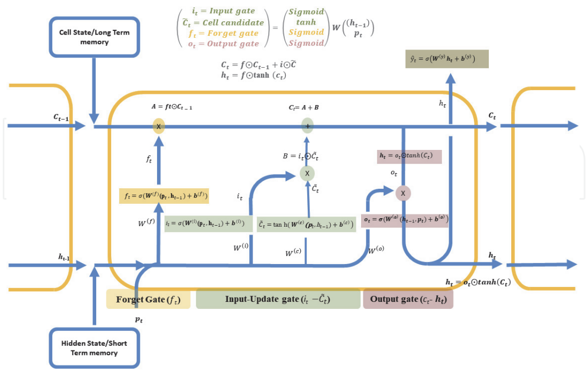

### Theory

#### Introduction to Sentiment Analysis
Sentiment Analysis is a supervised natural language processing (NLP) task that determines the emotional polarity (positive or negative) expressed in text. It is widely used in applications such as opinion mining, recommendation systems, and social media analysis.

In this experiment, sentiment analysis is formulated as a binary classification problem:

**y ∈ {0, 1}**

where,
- **0** = Negative review
- **1** = Positive review

---

#### Dataset Description - IMDB Movie Reviews
The experiment uses a subset of the **IMDB Large Movie Review Dataset**, which is a widely used benchmark dataset for sentiment analysis. It is used due to its real-world text complexity and long-term dependency modelling.

**Dataset characteristics:**
- Total reviews: 50,000 (original dataset).
- Binary sentiment labels: positive and negative.
- Reviews are pre-labelled and evenly balanced.

**Subset used in this experiment:**
- **Training + Validation:** 8,500 reviews.
- **Test set:** 1,500 reviews.
- Balanced distribution between positive and negative samples.

**Movie reviews are particularly challenging because:**
- Sentiment may depend on long-range word dependencies.
- Negations and context significantly affect meaning.
- Reviews vary greatly in length.

Hence, sequential models such as RNNs and LSTMs are well suited for this task.

---

#### Recurrent Neural Networks (RNNs)
Recurrent Neural Networks process sequential data by maintaining a hidden state that captures information from previous time steps. For a simple RNN, the hidden state and output are computed as:

**ht = tanh(Wh pt + Uh ht-1 + bh)**

**yt = σ(Wy ht + by)**

where,
- *pt* is the input vector at time step *t*.
- *ht-1* is the hidden state from the previous time step.
- *Wh*, *Uh*, and *Wy* are weight matrices.
- *bh* and *by* are bias vectors.
- *tanh* is the hyperbolic tangent activation function.
- *σ* denotes the sigmoid activation function used for binary classification.

**Limitations of RNNs:**
Despite their conceptual simplicity and ability to model sequences, standard RNNs suffer from several well-known limitations:
1.  **Vanishing and Exploding Gradient Problem:** During backpropagation through time (BPTT), gradients can either shrink exponentially (vanish) or grow uncontrollably (explode), making it difficult for the network to learn long-range dependencies.
2.  **Difficulty in Learning Long-Term Dependencies:** Due to unstable gradient flow, simple RNNs tend to focus only on recent inputs and fail to retain information from earlier time steps, especially in long sequences such as movie reviews.
3.  **Unstable Training Dynamics:** Training deep or long RNNs often requires careful initialization, gradient clipping, and learning rate tuning to prevent divergence.

These limitations motivated the development of more advanced recurrent architectures such as Long Short-Term Memory (LSTM) networks.

---

#### Long Short-Term Memory (LSTM)
LSTM is a specialized RNN architecture designed to overcome the limitations of standard RNNs by introducing gating mechanisms. It was introduced by Hochreiter and Schmidhuber in 1997 with the explicit purpose of helping address the unstable gradient problem. The gates allow LSTM to retain relevant information and discard irrelevant data over long sequences.

**LSTM Cell Components:**

1.  **Forget Gate (ft):** It decides the type of information that should be thrown away or kept from the cell state. This process is implemented by a sigmoid activation function.
    
    **ft = σ(Wf[ht-1, pt] + bf)**

2.  **Input Gate (it):** It controls what new information will be added to the cell state from the current input. This gate also plays the role to protect the memory contents from perturbation by irrelevant input.
    
    **it = σ(Wi[ht-1, pt] + bi)**

3.  **Candidate Cell State (C̃t):** This is the key to LSTMs and represents the memory of LSTM networks. The LSTM block removes or adds information to the cell state through the gates, which allow optional information to cross.
    
    **C̃t = tanh(Wc[ht-1, pt] + bc)**

4.  **Cell State Update (Ct):** This additive update mechanism allows gradients to flow across long sequences, enabling long-term dependency learning.
    
    **Ct = ft · Ct-1 + it · C̃t**

5.  **Output Gate (ot):** It controls which information to reveal from the updated cell state (Ct) to the output in a single time step. In other words, the output gate determines what the value of the next hidden state should be in each time step.
    
    **ot = σ(Wo[ht-1, pt] + bo)**

6.  **Hidden State (ht):** The hidden state represents the output of the LSTM cell at time step *t*. It is computed by applying a non-linear transformation to the updated cell state and modulating it with the output gate.
    
    **ht = ot · tanh(Ct)**

The neural network architecture for an LSTM block generally demonstrates that the LSTM network extends RNN's memory and can selectively remember or forget information by structures called cell states and three gates. Thus, in addition to a hidden state in RNN, an LSTM block typically has four more layers. These layers are called the cell state (Ct), an input gate (it), an output gate (ot), and a forget gate (ft). Each layer interacts with each other in a very special way to generate information from the training data.

**Fig. 1.** Architecture of LSTM. Source: H. Okut, “Deep Learning for Subtyping and Prediction of Diseases: Long Short-Term Memory,” IntechOpen).

The *pt*, *ht-1*, and *Ct-1* correspond to the input of the current time step, the hidden output from the previous LSTM unit, and the cell state (memory) of the previous unit, respectively. The information from the previous LSTM unit is combined with current input to generate a newly predicted value. The LSTM blocks are mainly divided into three gates: forget, input-update, and output. Each of these gates is connected to the cell state to provide the necessary information that flows from the current time step to the next.

---

#### Merits of Long Short-Term Memory

-   **Handles Long-Term Dependencies:** LSTM networks are capable of learning long-term dependencies in sequential data, overcoming the vanishing gradient problem present in traditional RNNs.
-   **Effective Memory Management:** The use of forget, input, and output gates allows LSTM to selectively store, update, or discard information, leading to better sequence modelling.
-   **Suitable for Sequential Data:** LSTMs perform well on time-series, text, speech, and sentiment analysis tasks where data has temporal dependencies.
-   **Stable Training:** Due to controlled gradient flow through the cell state, LSTMs provide more stable training compared to simple RNNs.
-   **Better Performance on Contextual Tasks:** LSTMs capture contextual information over longer sequences, improving performance in tasks such as language modelling and classification.

#### Demerits of Long Short-Term Memory

-   **High Computational Cost:** LSTM networks involve multiple gate computations, making them computationally expensive compared to standard RNNs.
-   **Longer Training Time:** Due to their complex structure, LSTMs require more time to train, especially on large datasets.
-   **Large Memory Requirement:** The presence of multiple weight matrices and gates increases memory consumption.
-   **Risk of Overfitting on Small Datasets:** When trained on small datasets, LSTMs may overfit if proper regularization techniques are not applied.
-   **Complex Architecture:** The internal structure of LSTM cells makes them harder to understand, tune, and debug compared to simpler models.